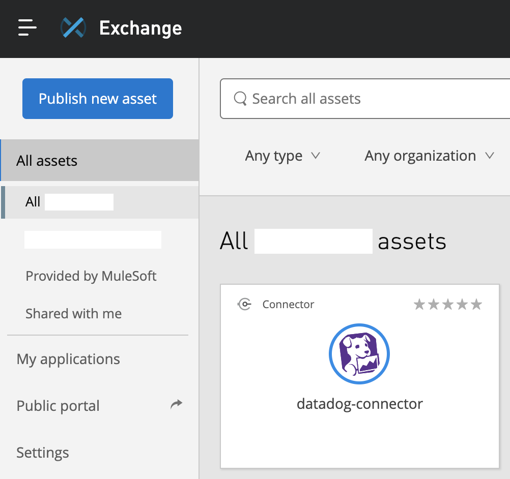
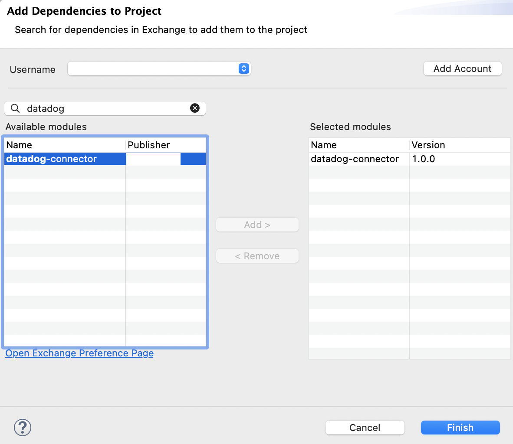
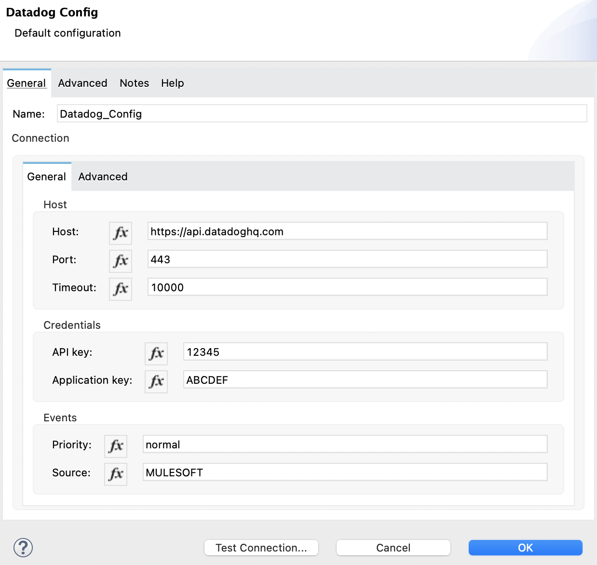
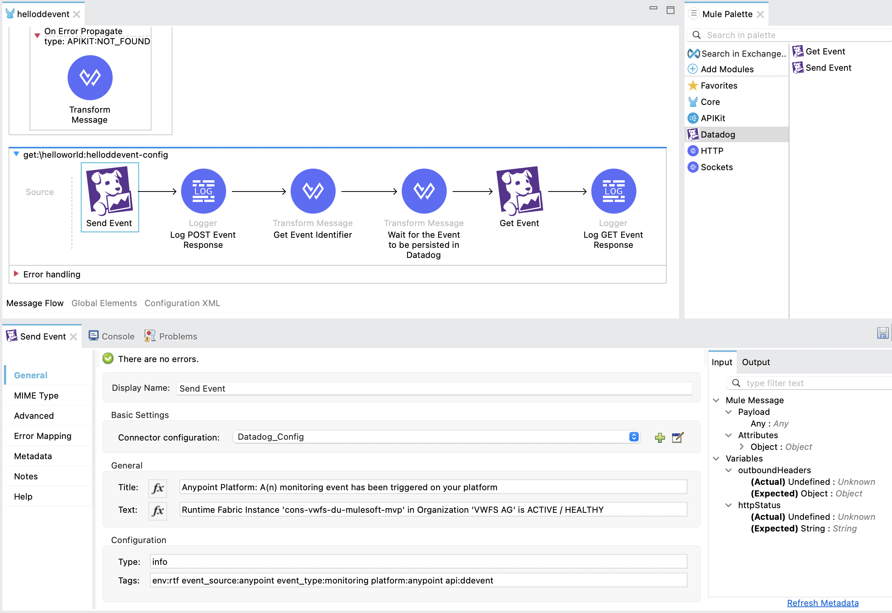

# A Mule Connector for Datadog
## Introduction
**Datadog** is an observability service for cloud-scale applications, providing monitoring of servers, databases, tools, and services, through a SaaS-based data analytics platform. See [Datadog](https://www.datadoghq.com/) for a product / platform overview.

## Datadog API
The **Datadog API** is an HTTP REST API. The API uses resource-oriented URLs to call the API, uses status codes to indicate the success or failure of requests, returns JSON from all requests, and uses standard HTTP response codes. See [API reference](https://docs.datadoghq.com/api/latest/) for the complete API reference.

## Supported Operations
The following is an overview of the supported Connector operation(s):

|No.|Operation|Description|Link|
|---|---|---|---|
|1|Send Event|Post events to the Datadog event stream|https://docs.datadoghq.com/api/latest/events/#post-an-event|

### Extending this Connector

This connector supports the creation of Datadog events only. The underlying Mule Extension project can be used as a starting point to further  encapsulate and enhance the Datadog API functionality.

## Usage
### Publish the Connector to Exchange

A **distributionManagement** section is available in the pom file. See https://docs.mulesoft.com/exchange/to-publish-assets-maven for additional details.

Asset publication to exchange:

```
$ mvn clean deploy -DmuleDeploy -DskipTests
```

The connector asset should be visible in Exchange, e.g.:
<center></center>

### Add the Connector to Anypoint Studio

Add the Datadog connector to the Mule Palette by performing an Exchange search, e.g.:
<center></center>

### Create Global Datadog Connection

Create the global Datadog connection configuration, e.g.:
<center></center>

### Post Datadog Event

Send Datadog events from Mule flows, e.g.:
<center></center>

## Todo / Ideas

1. Extend existing `Send Event` operation (e.g. `aggregation_key` and `related_event_id`)

2. Introduce Operations, e.g. to support:
- Event fetching
- Log aggregation
- Log searches
- Monitor management
- Synthetics management
- Etc.

## Key References
- Mule [Java SDK Documentation](https://docs.mulesoft.com/mule-sdk/1.1/getting-started)
- Datadog [Product / Platform](https://www.datadoghq.com/)
- Datadog [API Reference](https://docs.datadoghq.com/api/latest/)