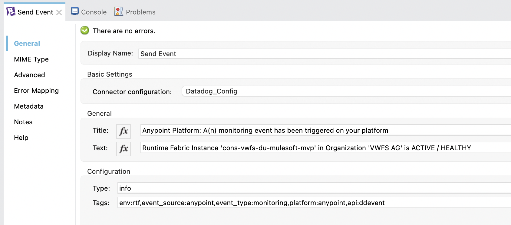
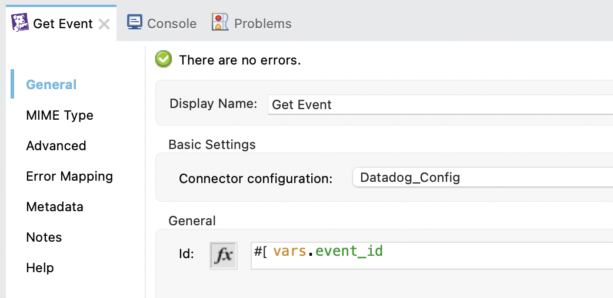
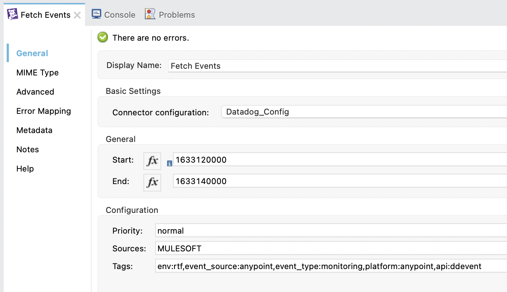
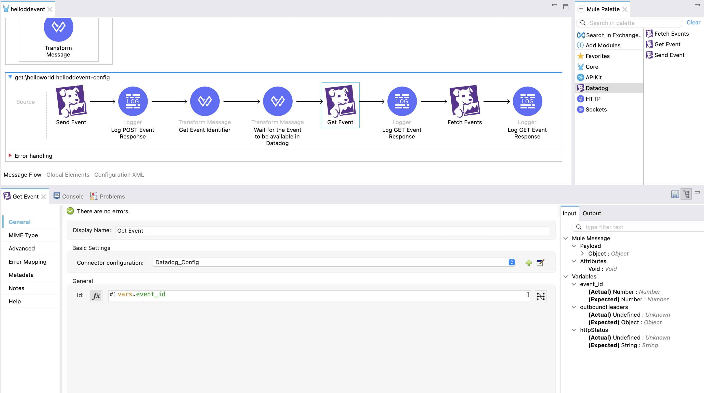

# A Mule Connector for Datadog
## Introduction
**Datadog** is an observability service for cloud-scale applications, providing monitoring of servers, databases, tools, and services, through a SaaS-based data analytics platform. See [Datadog](https://www.datadoghq.com/) for a product / platform overview.

## Datadog API
The **Datadog API** is an HTTP REST API. The API uses resource-oriented URLs to call the API, uses status codes to indicate the success or failure of requests, returns JSON from all requests, and uses standard HTTP response codes. See [API reference](https://docs.datadoghq.com/api/latest/) for the complete API reference.

## Supported Operations
The following is an overview of the supported Connector operation(s):

|No.|Operation|Description|Link|
|---|---|---|---|
|1|Get Event|Get a specific event from the Datadog event stream|https://docs.datadoghq.com/api/latest/events/#get-an-event|
|2|Get Events|Fetch events from the Datadog event stream|https://docs.datadoghq.com/api/latest/events/#query-the-event-stream|
|3|Send Event|Post a new event to the Datadog event stream|https://docs.datadoghq.com/api/latest/events/#post-an-event|

### Extending this Connector

The underlying Mule Extension project can be used as a starting point to further encapsulate and enhance the Datadog API functionality.

## Usage
### Update Group Id in POM

The default **groupId** is set to `org.mule.extensions`, in order to publish the connector to Exchange the **groupId** must be replaced with a valid organization id, e.g.:

```<groupId>org.mule.extensions</groupId>```

to

```<groupId>8aa90329-5931-4cc5-b212-5db10dec3257</groupId>```

### Publish the Connector to Exchange

A **distributionManagement** section is available in the pom file. See https://docs.mulesoft.com/exchange/to-publish-assets-maven for additional details.

Asset publication to exchange:

```
$ mvn clean deploy -DmuleDeploy -DskipTests
```

The connector asset should be visible in Exchange, e.g.:
<center></center>

### Add the Connector to Anypoint Studio

Add the Datadog connector to the Mule Palette by performing an Exchange search, e.g.:
<center></center>

### Create Global Datadog Connection

Create the global Datadog connection configuration, e.g.:
<center></center>

### Send Datadog Event
Send Datadog events from Mule flows, e.g.:
<center></center>

#### Properties
No.|Title|Comments|
---|---|---|
1|Title|Event Title|
2|Text|Event Text|
3|Type|Event Type (info, warning, error)|
4|Tags|Event Tag(s) (comma separated list)

### Get Datadog Event
Get Datadog events within Mule flows, e.g.:
<center></center>

#### Properties
No.|Title|Comments|
---|---|---|
1|Id|Event Id|

### Fetch Datadog Events
Fetch Datadog events within Mule flows, e.g.:
<center></center>

#### Properties
No.|Title|Comments|
---|---|---|
1|Start|Timestamp (Unix Epoch)|
2|End|Timestamp (Unix Epoch)|
3|Prioroty|Event Priority (low, normal)|
4|Sources|Event Source(s) (comma separated list)
4|Tags|Event Tag(s) (comma separated list)

### Example Flow

Example Mule flow demonstrating 'Send Event', 'Get Event' and 'Fetch Events', e.g.:
<center></center>

## Todo / Ideas

1. Extend the existing `Send Event` operation (e.g. `aggregation_key` and `related_event_id`)

2. Extend the existing `Fetch Event` operation (e.g. `unaggregated`, `exclude_aggregate` and `page`)

3. Introduce Operations, e.g. to support:
- Log aggregation
- Log searches
- Monitor management
- Synthetics management
- Etc.

## Key References
- Mule [Java SDK Documentation](https://docs.mulesoft.com/mule-sdk/1.1/getting-started)
- Datadog [Product / Platform](https://www.datadoghq.com/)
- Datadog [API Reference](https://docs.datadoghq.com/api/latest/)